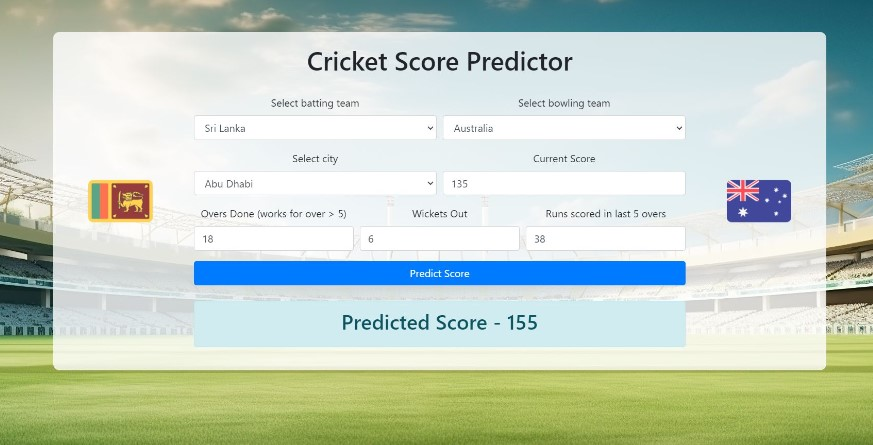
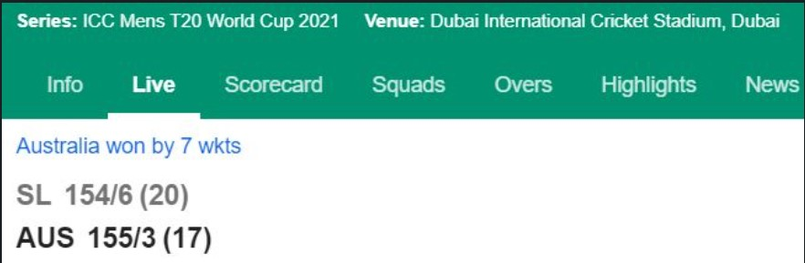

# Cricket Score Predictor

This Project is designed to predict the Score of T20 Cricket Matches using ML with PYTHON,FLASK,HTML.

## Table of Contents

- [Introduction](#introduction)
- [Features](#features)
- [Dataset](#dataset)
- [Tools Used](#Tools)
- [Results](#results)

## Introduction

The Cricket Score Predictor uses historical match data to forecast the scores of cricket games. It leverages machine learning algorithms to analyze past performances and predict future outcomes.

## Features

- Predict scores for upcoming cricket matches.
- Analyze historical match data.
- Give 94.7% accuracy in the predicted score.

## Dataset

- The dataset has data from multiple international teams and the T20 matches they played against each other with runs per ball.
- It also has the venue where the match was played, which plays an important role in deriving the predicted score.

## Tools Used

## Results

- The results gave us the predicted score as shown in the image below.
- The predicted score was very much closer to the real score scored by the team.
- I used HTML and Flask to visualize the interface of the score predictor where we can choose any of the 10 International Teams.

